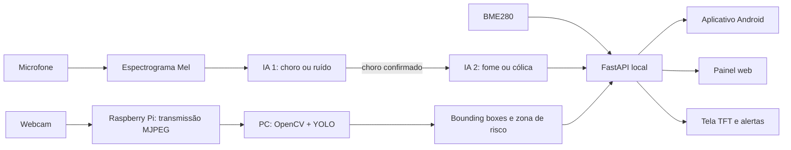

# CrySense AI

> Babá eletrônica inteligente com análise local de choro, monitoramento ambiental, vídeo em tempo real e detecção visual de situações de risco no berço.

## Sobre o projeto

O **CrySense AI** foi criado para oferecer mais tranquilidade e segurança aos cuidadores, especialmente a pais de primeira viagem. Em vez de apenas transmitir áudio e vídeo, o sistema utiliza inteligência artificial para identificar o choro do bebê e classificar seu padrão como mais associado à **fome** ou à **cólica**.

O áudio é convertido em uma representação bidimensional na escala **Mel**. A partir desse espectrograma, os modelos extraem características acústicas e comparam o padrão analisado com os exemplos utilizados no treinamento. O processamento acontece em duas etapas: a primeira IA diferencia `choro` de `ruído`; a segunda é executada somente após a confirmação do choro e o classifica como `fome` ou `cólica`.

O sistema também reúne vídeo ao vivo, dados ambientais e visão computacional. O Raspberry Pi transmite as imagens pela rede local, enquanto um computador pode executar **OpenCV + YOLO** para localizar pessoas com *bounding boxes* e verificar a entrada em uma zona de risco desenhada pelo próprio usuário sobre o berço. Alertas, medições e ocorrências ficam disponíveis no aplicativo Android, no painel web e na tela TFT.

Quando um padrão associado à cólica é identificado, o protótipo pode acionar uma intervenção sonora configurável, como ruído branco ou rosa. O histórico local permite acompanhar a recorrência das ocorrências e oferece informações de apoio aos cuidadores.

> O CrySense AI não realiza diagnóstico médico, não substitui avaliação profissional e não dispensa a supervisão de um responsável.

## Problema que busca solucionar

O choro é um dos principais meios de comunicação do bebê, mas sua interpretação pode gerar dúvida e ansiedade. O CrySense AI busca reduzir essa incerteza reunindo análise do choro, monitoramento visual, condições ambientais, alertas de risco e histórico de eventos em uma solução local, responsiva e centrada na privacidade.

## Como funciona

O Raspberry Pi permanece responsável pela captura de áudio, sensores, interface local e transmissão do vídeo. A visão computacional é executada no computador para preservar o desempenho do Raspberry Pi 3B.

## Funcionalidades

- Monitoramento contínuo do áudio e do ambiente.
- Detecção de `choro` × `ruído`.
- Classificação do choro como `fome` × `cólica`.
- Conversão do áudio em espectrogramas na escala Mel.
- Análise de arquivos WAV para demonstrações em ambientes barulhentos.
- Vídeo ao vivo no painel web e no aplicativo Android.
- Detecção de pessoas com YOLO e exibição de *bounding boxes*.
- Zona visual de risco desenhada pelo usuário sobre o vídeo.
- Alertas locais no aplicativo, painel web e tela TFT.
- Monitoramento de temperatura, umidade e pressão atmosférica.
- Histórico de ocorrências armazenado localmente.
- Intervenção sonora configurável em eventos associados à cólica.
- Rede Wi-Fi de emergência para demonstrações e feiras.

## Tecnologias

| Área | Tecnologias |
|---|---|
| Computação embarcada | Raspberry Pi 3B e Raspberry Pi OS Lite |
| Backend | Python, FastAPI, API REST e SQLite |
| Aprendizado de máquina | scikit-learn, Random Forest, NumPy e Joblib |
| Processamento de áudio | Análise espectral e escala Mel |
| Visão computacional | OpenCV e Ultralytics YOLO |
| Aplicativo móvel | Kotlin e Jetpack Compose |
| Comunicação | Wi-Fi local, HTTP e vídeo MJPEG |
| Hardware | BME280, INMP441, MAX98357A, webcam USB e TFT ST7735 |

## Metodologia

- **Pipeline em duas etapas:** a classificação do tipo só ocorre após a confirmação do choro.
- **Confirmação temporal:** limiares de confiança e múltiplas janelas consecutivas reduzem ativações isoladas.
- **Arquitetura local-first:** áudio, vídeo, eventos e dados sensíveis permanecem sob controle da rede local.
- **Processamento distribuído:** o Raspberry mantém as funções embarcadas e o computador executa o YOLO.
- **Zona configurável:** a área de risco é marcada pelo cuidador conforme a posição real da câmera e do berço.

## Objetivo

O projeto visa apoiar decisões rápidas, reduzir a ansiedade dos cuidadores e aumentar a percepção de segurança durante a rotina do bebê, sem substituir o cuidado humano.
